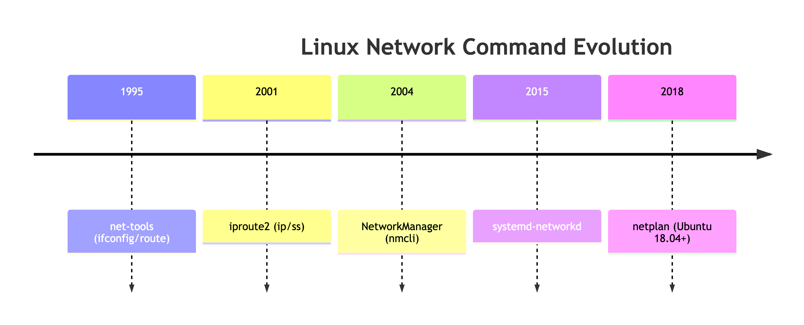

# NetWork

1. `net-tools` **Suite (1990s~2009)**
- **Era**: Early 1990s (deprecated after 2013)

- **Key Commands**:

    - `ifconfig`: Configure network interfaces (IP/MAC/status).

    - `route`: Manage routing tables (`route -n` for numeric output).

    - `netstat`: Show connections/routing/statistics (`netstat -tulnp` for ports).

    - `arp`: Manage ARP cache (`arp -a`).

    - `iwconfig`: Wireless config (replaced by `iw`).

- **Status**:

    - Directly read/wrote to `/proc/net/` kernel files.

    - **Not pre-installed on Ubuntu 18.04+**. Install manually:
    ```bash
    sudo apt install net-tools
    ```
2. `iproute2` **Suite (2001~Present)**
- **Era**: Introduced with Linux 2.4 kernel (standard since ~2010)

- **Key Commands**:

    - `ip`: Unified tool (`ip a`, `ip route`, `ip link`).

    - `ss`: Modern `netstat` replacement (`ss -tulnp`).

    - `tc`: Traffic control (QoS).

    - `bridge`: Bridge management (replaced `brctl`).

- **Advantages**:

    - Uses kernel Netlink API (faster/more features).

    - **Default on Ubuntu 20.04+**.

3. `NetworkManager` **Tools (2004~Present)**
- **Era**: Designed for dynamic networks (Wi-Fi/VPN)

- **Key Commands**:

    - `nmcli`: Command-line tool (`nmcli device show`).

    - `nmtui`: Text-based UI.

    - GUI apps (e.g., `nm-connection-editor`).

- **Purpose**:

    - Handles automatic connections (common on Ubuntu Desktop).

4. `systemd-networkd` **(2015~Present)**
- **Era**: Part of `systemd` ecosystem

- **Key Tools**:

    - `networkctl`: Status checks (`networkctl list`).

    - Config files: `/etc/systemd/network/*.network.`

- Use Case:

    - Lightweight alternative for servers/headless systems.

5. **Deprecated/Niche Tools**

|Command|	Purpose|	Replacement|	Active Era|
|------|-------|-----------|----------|
|`ifupdown`|	Basic interface config|	`netplan`	|2000~2018|
|`brctl`|	Bridge management	|`ip bridge`	|2000~2010|
|`dhclient`|	DHCP client	|`networkd`	|2000~2015|

## Timeline

